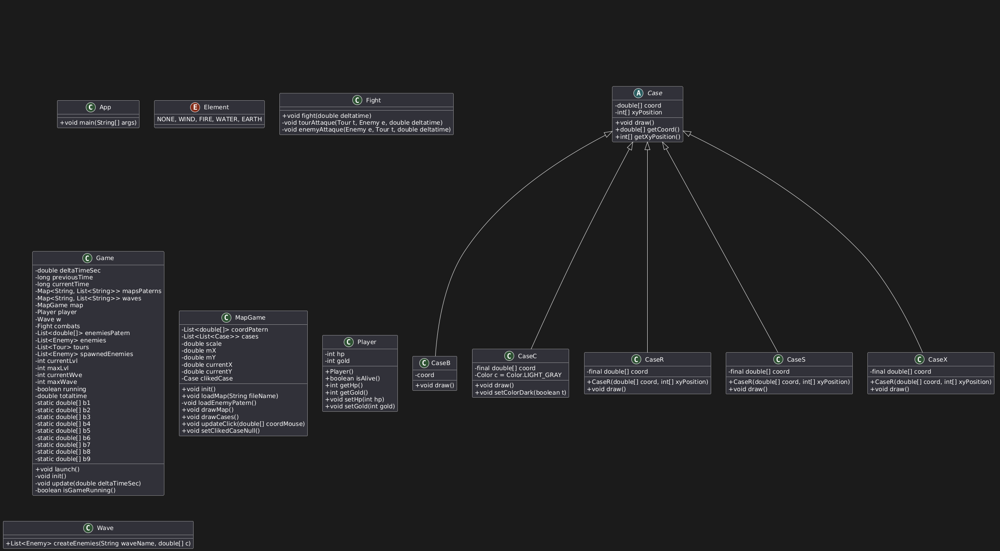
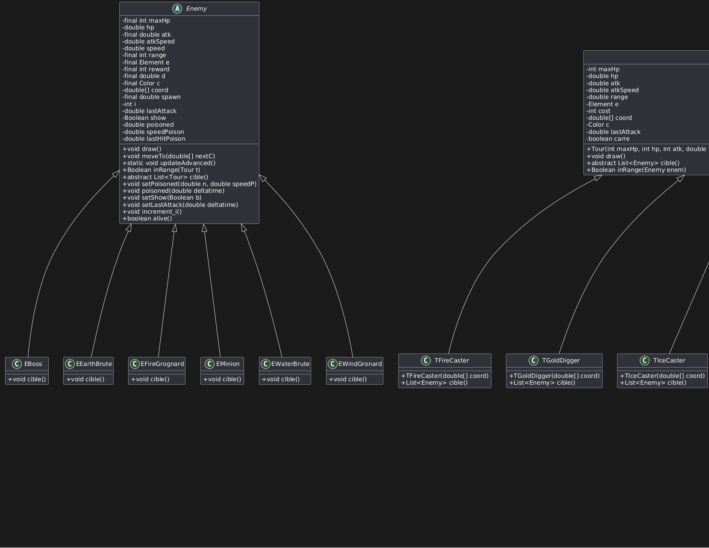

*Lucas David et Titouan Roullais*

# Projet PO

**Projet PO Tower Defense** est un jeu de défense de tour (Tower Defense) développé en Java. Le jeu consiste à protéger votre base contre des vagues successives d'ennemis en plaçant stratégiquement des tours sur la carte. Chaque tour a des caractéristiques uniques et peut cibler les ennemis de différentes manières, de même que chaque ennemi a aussi des caractéristiques uniques.

## Fonctionnalités

- **Tours variées** : Plusieurs types de tours avec des capacités et des éléments différents (Feu, Eau, Vent, Terre).
- **Ennemis divers** : Différents types d'ennemis avec des caractéristiques uniques.
- **Vagues et niveaux** : Le jeu comporte plusieurs niveaux, chacun avec plusieurs vagues d'ennemis.
- **Système de combat** : Les tours attaquent automatiquement les ennemis à portée, et les ennemis attaquent les tours et la base.
- **Gestion des ressources** : Les joueurs doivent gérer leurs points de vie et leur or pour acheter et améliorer des tours.

## Démarrage

Ouvrez le dossier "Projet PO" dans VS Code, puis lancez le programme avec la classe principale `App.java`.

## Utilisation de ChatGPT

- `MapGame.java`, dans la fonction `drawCases()`, les formules pour remplir l'espace vide sur la carte des niveaux 1 et 2 ont été trouvées grâce à l'aide de ChatGPT.
- `Game.java`, ligne 91 : Solution proposée par l'IA pour lire les fichiers, car la formule du cours ne fonctionnait pas.
- `Game.java`, ligne 271 : ChatGPT a corrigé les erreurs de suppression d'éléments dans une liste en train d'être lue par une boucle.
- ChatGPT n'a pas directement aidé en donnant des parties du code toutes faites, mais en servant de débogueur et moteur de recherche. Il a aidé pour StdDraw, List/ArrayList, Map/HashMap, afin d'apprendre et comprendre certaines méthodes de ces bibliothèques.

Voici tout l'historique :
https://chatgpt.com/share/677c3edf-1104-8011-a91e-3ba9ea64e362
Autre discussion pour le chargement des fichiers : [texte](conversation_without_image_v2.txt)

## Travail effectué

Toutes les étapes 1, 2, 3, 4, 5, 6, 7 et 8 on été réalisé, parmis les unitées bonus, uniquement des tours on été ajoutées. Malheureusment les systèmes d'erreurs ainsi que sauvegarde n'ont pas été réalisés.
Le nombre d'hp des tours on été multiplier par 5 ainsi que les l'argent gagner sur les ennemis tué multiplier par 2, afin d'équilibrer le jeu.

## Diagramme

